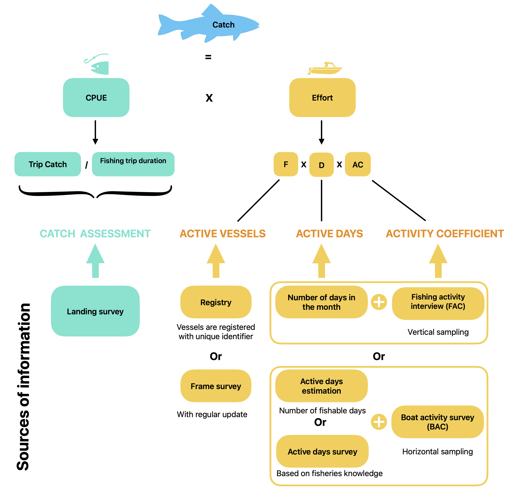
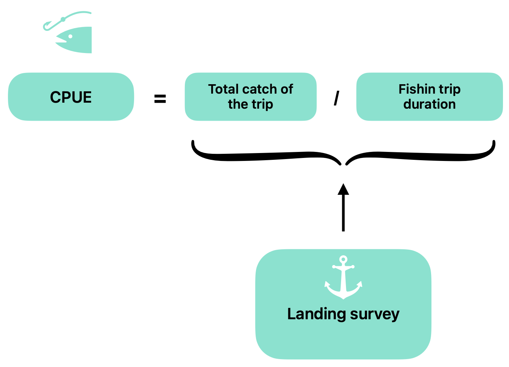
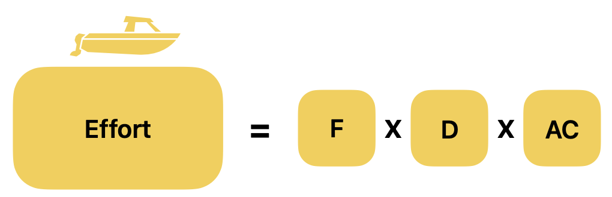

# Statistical framework of the ARTFISH methodology

### 1. Introduction

This vignette presents the statistical and conceptual framework that
underpins the ARTFISH methodology implemented in the `artfishr` package.

The aim of the ARTFISH methodology is to produce country-level estimates
of catch and fishing effort. It is a **sample-based approach** relying
on **stratified random sampling**.

ARTFISH stands for *Approaches, Rules and Techniques for Fisheries
Statistical Monitoring*. It was developed as a standardized methodology
adaptable to most fisheries in developing countries. Its design was
driven by the need to provide users with robust, user-friendly, and
reliable approaches while supporting the implementation of
cost-effective fishery statistical systems with minimal external
assistance.

The methodology was developed and described by Constantine Stamatopoulos
(Stamatopoulos, 2002) and is currently promoted by the Food and
Agriculture Organization of the United Nations (FAO).

### 2. ARTFISH methodology

#### 2.1 Presentation of the generic formula

ARTFISH is based on the concept of catch per unit effort (CPUE), using
the following relationships:

``` math
\mathrm{CPUE}=\frac{Catch}{Effort}
```

``` math
\mathrm{Catch}=\mathrm{CPUE}\times\mathrm{Effort}
```

Where:

- **Catch** refers to the total catch (all species combined) and is
  usually estimated within a defined context:
  - a geographical area (stratum),
  - a reference period (e.g. one calendar month),
  - a specific fishing unit.
- **CPUE** (estimated from the sample) is the average catch per unit of
  effort. It represents the average quantity of fish (all species
  combined) caught per unit of effort within the same estimation
  context.
- **Effort** (estimated from the sample) is expressed as the total
  number of boat-days within the same estimation context.

CPUE and effort are estimated from sample data. The data sources may
vary depending on the information available in each country and the
survey design implemented.

Figure 1 illustrates the estimation process when sampling is performed
in both time and space, that is, when only a subset of sampling days and
landing sites is surveyed.

**Figure 1.** ARTFISH conceptual
framework.

#### 2.2 Stratification

As in most statistical methods, ARTFISH estimates are first computed for
each stratum before being aggregated to produce estimates at higher
levels (e.g. total national catch).

The first level of stratification generally corresponds to the reference
period. In ARTFISH, data collection is usually organised on a monthly
basis. However, fishing seasons may be more appropriate than calendar
months in some contexts. The selected reference period therefore defines
the first level of stratification.

Additional levels of stratification can be defined when required:

- **Major strata**, usually based on administrative, geographical, or
  temporal criteria.
- **Minor strata**, corresponding to subdivisions of a major stratum.
- **Fishing units**, representing the lowest level of stratification.
  Fishing units are defined to describe the structure of the fisheries
  sector within the country.

Major and minor strata are optional and should only be defined when
justified by the local context or logistical constraints.

> **Important**
>
> Population parameters are always estimated at the lowest level of
> stratification. Estimates at higher levels are obtained by aggregating
> the corresponding lower-level estimates.

The sample size for each stratum can be determined using preliminary
data. When no prior information is available, the following sampling
effort is recommended:

- 8 to 12 sampling days per month;
- at least 30 landing surveys;
- at least 70 effort surveys.

### 3. CPUE

CPUE is calculated from data collected during the landing survey and is
expressed as the weight of catch (kg or lbs) per day.

**Figure 2.** CPUE estimation
principle.

To estimate CPUE, the following variables must be collected:

- the fishing unit (as defined in the sampling plan);
- the total catch weight (all species combined, and detailed by species
  for estimation per species);
- the fishing trip duration (i.e. time spent fishing).

CPUE is calculated for each stratum (defined by the combination of a
reference period, major and/or minor strata, and fishing unit) using the
following formula:

``` math
\mathrm{CPUE}=
\frac{\sum_{i=1}^{n} Catch_i}
{\sum_{i=1}^{n} UnitEffort_i}
```

Where:

- $`Catch_i`$ is the total catch of the $`i`$-th sampled fishing trip.
- $`UnitEffort_i`$ is the fishing effort associated with the $`i`$-th
  sampled fishing trip.
- $`n`$ is the number of fishing trips sampled within the estimation
  context.

In ARTFISH, the unit of effort is expressed in days, corresponding to
the fishing trip duration (or time spent fishing, depending on the level
of detail collected). Consequently, the CPUE formula used in ARTFISH
becomes:

``` math
\mathrm{CPUE}=
\frac{\sum_{i=1}^{n} Catch_i}
{\sum_{i=1}^{n} TripDuration_i}
```

**Table 1.** Example of landing survey records used for CPUE
calculation.

| Fishing trip ID | Catch | Catch unit | Effort | Effort unit |
|:----------------|------:|:-----------|-------:|:------------|
| Fishing trip 1  |   165 | kg         |      2 | day         |
| Fishing trip 2  |     0 | kg         |      1 | day         |
| Fishing trip 3  |    90 | kg         |      1 | day         |

The CPUE is therefore calculated as:

``` math
\mathrm{CPUE}
=
\frac{165+0+90}{2+1+1}
=
63.75~\mathrm{kg/day}
```

> **Warning**
>
> Fishing trips with zero catch must be recorded and included in the
> calculation.
>
> In this example, excluding fishing trips with zero catch would result
> in:
>
> ``` math
> \mathrm{CPUE}
> =
> \frac{165+90}{2+1}
> =
> 85~\mathrm{kg/day}
> ```
>
> As a consequence, the overall catch would be overestimated.

### 4. Effort

#### 4.1 Presentation

When sampling is performed in both time and space, the estimation of
fishing effort requires three components.



**Figure 3.** Effort estimation principle.

Where:

- $`D`$ is the raising factor expressing the total number of days with
  fishing activity during the reference period. It is estimated from an
  active days survey.
- $`F`$ is the raising factor expressing the total number of fishing
  units potentially operating across all fishing sites within the
  stratum. It is estimated from a frame survey or a vessel registry.
- $`AC`$ is the activity coefficient. Fishing unit activity can be
  estimated either through the boat activity coefficient ($`BAC`$),
  using vertical sampling (boat counts), or through the fishing activity
  coefficient ($`FAC`$), using horizontal sampling (fisher interviews).

The total fishing effort is therefore estimated as:

``` math
\mathrm{Effort}
=
F \times D \times BAC
```

or

``` math
\mathrm{Effort}
=
F \times D \times FAC
```

Both $`BAC`$ and $`FAC`$ express the probability that a fishing unit
(boat) is active on any given day during the reference period. $`BAC`$
is estimated from a boat activity survey, whereas $`FAC`$ is estimated
from fisher interviews.

#### 4.2 Number of active vessels: Estimation of the raising factor expressing the total number of active fishing units ($`F`$)

The raising factor $`F`$ represents the number of boats that are active
within the fishing fleet and are therefore potentially capable of
fishing during the sampling period.

Depending on how the fleet is managed, $`F`$ can be estimated from:

- a frame survey, when boats are not registered;
- a vessel registry, when registration with the fisheries or maritime
  administration is mandatory.

Other data sources may also be considered and are currently being
explored, such as household surveys for small-scale fisheries.

For stratum $`i`$ and fishing unit $`j`$, $`F`$ is calculated as the sum
of the number of boats belonging to fishing unit $`j`$ across all sites
included in the stratum:

``` math
F_{i,j}
=
\sum_{k=1}^{q} x_{i,j,k}
```

Where:

- $`x_{i,j,k}`$ is the number of potentially active vessels of fishing
  unit $`j`$ at site $`k`$ within stratum $`i`$.
- $`k`$ is the site index, ranging from $`1`$ to $`q`$. *(to complete if
  required)*
- $`q`$ is the total number of sites within stratum $`i`$.
- $`F_{i,j}`$ is the raising factor for stratum $`i`$ and fishing unit
  $`j`$.

#### 4.3 Number of active days: Estimation of the time raising factor ($`D`$)

The time raising factor $`D`$ represents the total number of days during
the reference period that are considered normal fishing days. It is
obtained by starting from the total number of calendar days and
subtracting days during which fishing is not expected to occur
(e.g. weekends, public holidays, or bad weather).

The value of $`D`$ is estimated for a given estimation context
(reference period, geographical stratum, and fishing unit). The target
population therefore corresponds to all calendar days within the
reference period.

For stratum $`i`$ and fishing unit $`j`$, $`D`$ can be calculated as:

``` math
D_{i,j}
=
\text{Number of days in the month}
-
\text{Number of non-potentially fishing days}
```

**Table 2.** Example template for the active days survey.

| Minor strata | Fishing unit (FU) | Number of non-potentially fishing days | Remarks |
|:---|:---|---:|:---|
| Strata 1 | FU 1 | 8 | No fishing during Saturday and Sunday |
|  | FU 2 | 9 | No fishing on Sunday + 5 bad weather days |
|  | … | … | … |
|  | FU p | 4 | No fishing on Sunday |
| Strata 2 | … | … | … |
| … |  |  |  |
| Strata n |  |  |  |

For example, in Table 2, for Strata 1 and Fishing Unit 2:

``` math
D = 31 - 9 = 22
```

When several sites belong to the same stratum, $`D`$ is calculated as
the weighted mean of the site-specific values, using the number of boats
as weights.

``` math
D_{i,j}
=
\frac{\sum_{m=1}^{t} D_{i,j,m}\times x_{i,j,m}}
{\sum_{m=1}^{t} x_{i,j,m}}
```

Where:

- $`m`$ is the site index, ranging from $`1`$ to $`t`$.
- $`t`$ is the total number of sampled sites.
- $`x_{i,j,m}`$ is the number of active boats at site $`m`$ in stratum
  $`i`$ for fishing unit $`j`$.
- $`D_{i,j,m}`$ is the estimated number of active fishing days at site
  $`m`$ in stratum $`i`$ for fishing unit $`j`$.

#### 4.4 Activity coefficient: Estimation of the boat activity coefficient ($`BAC`$) or fishing activity coefficient ($`FAC`$)

##### 4.4.1 Difference between $`BAC`$ and $`FAC`$

The activity coefficient accounts for the variability in fishing
activity among boats by estimating the probability that a fishing unit
is active on a given day.

Fishing activity can be estimated either through the boat activity
coefficient ($`BAC`$), based on vertical sampling, or through the
fishing activity coefficient ($`FAC`$), based on horizontal sampling.

The total fishing effort is therefore estimated as:

``` math
\mathrm{Effort}
=
F \times D \times BAC
```

or

``` math
\mathrm{Effort}
=
F \times D \times FAC
```

The effort is expressed in boat-days when CPUE is expressed in kg/day.

- **Horizontal sampling.** Information on fishing activity is collected
  by interviewing fishers during the landing survey. A typical question
  asks how many days they have fished during a fixed reference period
  (e.g. the previous 5 or 30 days). This approach is used to estimate
  $`FAC`$.

- **Vertical sampling.** Fishing activity is estimated by counting, at
  regular intervals, the total number of boats present at landing sites
  and the number of boats that actually went fishing. This approach is
  more demanding but may be preferable where boat movements are
  important or fishing activity is influenced by seasonal or lunar
  cycles (e.g. light fishing for sardinellas). This approach is used to
  estimate $`BAC`$.

##### 4.4.2 Boat activity coefficient

For stratum $`i`$ and fishing unit $`j`$, $`BAC`$ is calculated by
dividing the total number of boats that went fishing by the total number
of boats observed (from either the frame survey or the vessel registry):

``` math
BAC_{i,j,m}
=
\frac{\sum_{e=1}^{E} BoatsOut_{i,j,m,e}}
{\sum_{e=1}^{E} Boats_{i,j,m,e}}
```

Where:

- $`m`$ is the site index, ranging from $`1`$ to $`t`$.
- $`t`$ is the total number of sampled sites.
- $`e`$ is the sampled day index, ranging from $`1`$ to $`E`$.
- $`E`$ is the total number of sampled days.
- $`Boats_{i,j,m,e}`$ is the number of boats recorded at site $`m`$ in
  stratum $`i`$ for fishing unit $`j`$.
- $`BoatsOut_{i,j,m,e}`$ is the number of boats that went fishing on day
  $`e`$ at site $`m`$ in stratum $`i`$ for fishing unit $`j`$.

When the frame survey is used, the formula becomes:

*(Formula to be completed.)*

Where:

- $`x_{i,j,m}`$ is the number of boats at site $`m`$ in stratum $`i`$
  for fishing unit $`j`$.

##### 4.4.3 Fishing activity coefficient

A simple question can be added to the landing survey questionnaire to
estimate fishing activity for each fishing unit:

**How many days have you fished over the last 5 days?**
\_\_\_\_\_\_\_\_\_\_

For one-day fishing trips, a reference period of 5 to 7 days is
generally sufficient. For longer fishing trips (e.g. two or three
weeks), it is more appropriate to use a 30-day reference period. In this
case, the question may be reformulated as:

*“How many days have you been on land during the last 30 days?”*

The reference period should be defined separately for each fishing unit.

For stratum $`i`$ and fishing unit $`j`$, $`FAC`$ is calculated as:

``` math
FAC_{i,j}
=
\frac{\sum_{b=1}^{z} DaysActive_{i,j,b}}
{z \times RefTime}
```

Where:

- $`b`$ is the interview index, ranging from $`1`$ to $`z`$.
- $`z`$ is the total number of interviews.
- $`DaysActive_{i,j,b}`$ is the number of days the interviewed fisher
  was active during the reference period.
- $`RefTime`$ is the duration of the reference period (e.g. 5 or 30
  days).
- $`DaysSelected_{i,j}`$*(to check: not used in the current formula).*

## 5. Total catch estimation and catch per species

### 5.1 Catch per species per stratum

Once the total catch has been estimated, the catch of each species is
obtained using the following relationship:

``` math
SpeciesCatch
=
SP \times Catch
```

Where:

- $`SpeciesCatch`$ is the estimated catch of a given species within the
  estimation context.
- $`SP`$ is the proportion of the total catch represented by the species
  in the sampled landings.
- $`Catch`$ is the estimated total catch within the estimation context.

Using the estimated fishing effort, species-specific CPUE values can
also be calculated.

### 5.2 Total catch estimation

The total catch for a given reference period is obtained by summing the
estimated catches across all strata (all fishing units and all major and
minor strata, when applicable).

``` math
TotalCatch
=
\sum_{i=1}^{S} Catch_i
```

Where:

- $`i`$ is the stratum index, corresponding to a unique combination of
  reference period, geographical stratum, and fishing unit.
- $`S`$ is the total number of strata. *(to complete)*

## 6. Estimation quality control

The quality of the estimates is assessed using the different accuracy
indicators calculated by the ARTFISH methodology.

Two complementary approaches are used to assess **spatial accuracy**,
which reflects the adequacy of the sampling effort. Temporal accuracy is
not estimated because the temporal population (calendar days within the
reference period) is considered to be fully defined.

The methodology combines algebraic and probabilistic approaches to
evaluate the accuracy of both CPUE and activity coefficient ($`AC`$)
estimates.

The following indicators are produced:

- Spatial accuracy of the activity coefficient ($`AC`$);
- Temporal accuracy of the activity coefficient ($`AC`$), which is
  always equal to 1 and therefore does not require estimation;
- Spatial accuracy of CPUE;
- Temporal accuracy of CPUE.

The overall sampling accuracy is defined as the minimum of these four
indicators. It should be examined first. If the overall accuracy is low
(e.g. below 80%), the individual accuracy indicators can then be used to
identify the source of the highest variability.

### 7 References

Stamatopoulos, C. (2002). *Sample based fishery surveys: A technical
handbook*. FAO Fisheries Technical Paper No. 425. Rome: Food and
Agriculture Organization of the United Nations. 132 pp. Available at:
<https://www.fao.org/3/y2790e/y2790e.pdf>
